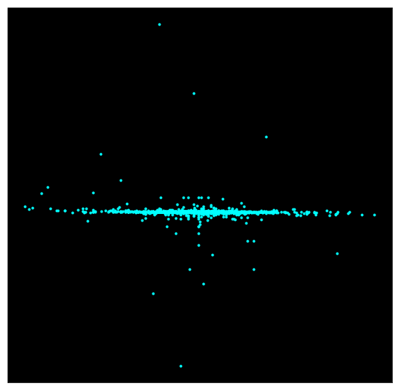
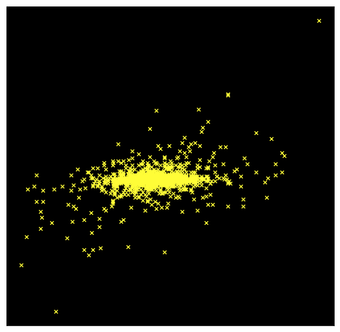

```python
from random import randint
from statistics import mean, median
```


```python
from matplotlib import pyplot, rcParams
```


```python
def vectors(minAmount, maxAmount):
    v = []
    means = []
    medians = []
    y = []
    yDiv = randint(-5, 5)
    if yDiv == 0:
        yDiv = randint(1, 5) if randint(1, 2) == 1 else randint(-5, -1)

    yDivChanges = randint(1, 2) == 1

    for i in range(randint(minAmount, maxAmount)):
        v.append([])
        for j in range(randint(3, 1000)):
            v[i].append(randint(-100, 100))

        means.append(mean(v[i]))
        medians.append(median(v[i]))

        if yDivChanges:
            yDiv += randint(-5, 5)
            if yDiv == 0:
                yDiv = 1

        y.append((max(v[i]) + min(v[i])) / yDiv)
    
    return means, medians, y

def generate_galaxy():
    markers = ["x", ".", "o"]
    colours = ["xkcd:baby blue", "xkcd:sky blue", "xkcd:sunshine yellow", "xkcd:light yellow", "xkcd:cyan", "xkcd:white"]
    
    means, medians, y = vectors(5000, 10000)
    
    meansOrMedians = "means" if randint(1, 100) <= 30 else "medians"
    x = means if meansOrMedians == "means" else medians

    rcParams["figure.figsize"] = 10, 10
    pyplot.scatter(x, y, marker=markers[randint(0, len(markers) - 1)], color=colours[randint(0, len(colours) - 1)])
    
    if randint(1, 100) <= 40:
        means, medians, y = vectors(3, 3333)
        if meansOrMedians == "means":
            x = means if randint(1, 100) <= 80 else medians
        else:
            x = medians if randint(1, 100) <= 80 else means
        pyplot.scatter(x, y, marker=markers[randint(0, len(markers) - 1)], color=colours[randint(0, len(colours) - 1)])
            
    
    pyplot.xticks([], [])
    pyplot.yticks([], [])
    pyplot.gca().set_facecolor("black")
    pyplot.show()

for i in range(5):
    generate_galaxy()
```


```python
for i in range(25):
    generate_galaxy()
```





```python
for i in range(25):
    generate_galaxy()
```





